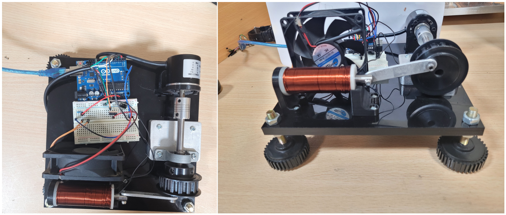

# Mechatronics-Course-Project
# Solenoid-Driven Rotary Motor with Closed-Loop Speed Control

## Project Overview

This project involved the design, fabrication, and control of a solenoid-driven rotary motor. The motor was developed with a strict size constraint of 20 cm³ and is powered by a 12V, 2A supply. The key objective was to achieve precise closed-loop speed control using a custom-built solenoid, translating linear force into rotational motion through a crank mechanism.

Key features of the project include:
- **Dynamic simulation** to optimize motor performance.
- **Closed-loop control** for accurate speed regulation.
- **Temperature monitoring** for safe operation.
- **Digital display** for real-time speed visualization.

## Table of Contents
- [Introduction](#introduction)
- [Design and Development](#design-and-development)
  - [Mechanical Design](#mechanical-design)
  - [Electromagnetic Design](#electromagnetic-design)
  - [Dynamic Simulation](#dynamic-simulation)
  - [Circuit Design](#circuit-design)
  - [Firmware](#firmware)
- [Results and Discussion](#results-and-discussion)
- [Conclusion](#conclusion)
- [Appendices](#appendices)

## Introduction

The primary goal of this project was to design and construct a self-contained electromagnetic actuation system that converts electrical energy into rotational mechanical motion. A custom solenoid was developed, combined with a mechanical crank arrangement, to achieve smooth and controlled rotation of a flywheel-loaded shaft.

## Design and Development

### Mechanical Design
- **Components**: Solenoid, flywheel, rotating shaft, crank, ball bearing, and encoder.
- **Tools Used**: SolidWorks for 3D modeling and design.
- **Optimization**: MATLAB was used to optimize the crank mechanism for maximum torque.

### Electromagnetic Design
- **Coil Specifications**: Designed with a coil resistance of 4.2 Ω and approximately 1000 turns.
- **Simulation Tools**: ANSYS-Maxwell for electromagnetic simulation.
- **Optimization**: Air-gap and current levels were optimized to achieve the required force and torque.

### Dynamic Simulation
- **Simulation Tool**: ADAMS was used to simulate the dynamic behavior of the motor.
- **Results**: The optimal length of the crank was determined to be 5.6 cm based on simulations.

### Circuit Design
- **Components**: Arduino Uno, encoder, thermistor, FETs, and other essential electronic components.
- **Functionality**: The circuit ensures regulated power delivery, sensor data acquisition, and control signal transmission.

### Firmware
- **Control Algorithm**: The system employs a PI controller for motor speed regulation.
- **Temperature Monitoring**: Continuous monitoring of temperature to ensure safe operation.
- **Programming Languages**: Arduino (C/C++) for motor control and Python for GUI.

## Results and Discussion

The project successfully demonstrated closed-loop speed control of the motor with the designed solenoid and circuit. The temperature monitoring system ensured safe operation, and the digital display provided real-time speed visualization.

## Conclusion

The project met its objectives of designing a compact, self-contained rotary motor with precise speed control. The combination of dynamic simulation, mechanical and electromagnetic design, and robust control algorithms resulted in a highly efficient and reliable motor.

## Appendices

[Report.pdf](./report.pdf)

## Supervisor
- [**Dr. Sadighi**](https://www.researchgate.net/scientific-contributions/Ali-Sadighi-2241827998)

